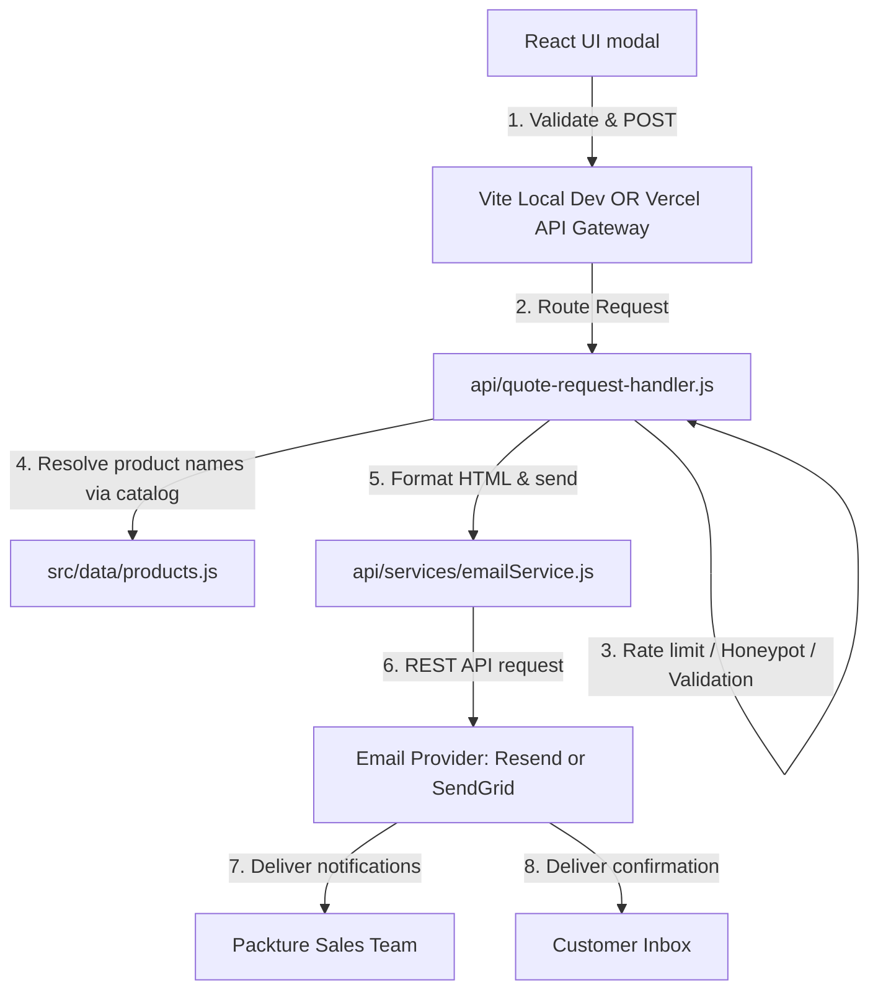

# Packture International B2B Quote Email Integration Setup

This document outlines the architecture, environment configuration, local testing steps, and production deployment procedures for the B2B Quote Request email notification system.

---

## 1. System Architecture

The B2B Quote Request system uses a decoupled, server-side design to ensure customer details and email API keys remain secure.



---

## 2. Required Environment Variables

To prevent exposing private credentials to the client browser, all email settings and API keys are stored on the server.

Create a `.env` file in the root directory (based on `.env.example`):

```bash
# 1. Sales Recipient Address
PACKTURE_SALES_EMAIL=sales@example.com

# 2. Verified Sender Address
PACKTURE_FROM_EMAIL=no-reply@example.com

# 3. Email Provider API Key
EMAIL_API_KEY=re_your_api_key_here

# 4. Optional: Provider Selection ('resend' or 'sendgrid')
EMAIL_PROVIDER=resend

# 5. Optional: Toggle Customer Confirmation Emails ('true' or 'false')
SEND_CUSTOMER_CONFIRMATION=true
```

---

## 3. Email Provider Setup

### Choice A: Resend (Default)
1. Sign up for a free account at [Resend.com](https://resend.com).
2. Navigate to **Domains** and verify your domain (e.g. `packtureinternational.in`) to send emails from your custom address.
3. Go to **API Keys**, create an API key with write permissions, and assign it to `EMAIL_API_KEY`.
4. Set `EMAIL_PROVIDER=resend`.

### Choice B: SendGrid
1. Sign up at [SendGrid.com](https://sendgrid.com).
2. Set up **Sender Authentication** for your domain or individual email address.
3. Create an API key under **Settings > API Keys** and set it as `EMAIL_API_KEY`.
4. Set `EMAIL_PROVIDER=sendgrid`.

---

## 4. Local Development

You can run and test the complete email submission flow locally with zero external server dependencies:

1. Copy `.env.example` to `.env` in the project root.
2. Run `npm run dev`.
3. Fill out the quote modal inside the browser and hit **Send Quote Request**.
4. **Mock Mode (Default):** If `EMAIL_API_KEY` is blank or omitted, the system runs in a sandboxed "Dry Run" mode. Submissions will succeed immediately, and the generated HTML emails will be logged directly to the terminal console.
5. **Real Mode:** Once you insert a valid `EMAIL_API_KEY` and verified sender address in `.env`, submissions will send real emails instantly.

---

## 5. Security Measures

* **Honeypot Protection:** Includes an invisible `website` input. Automated spam bots that fill this field are silently rejected. The server responds with a mock success code to exhaust the bot's retry cycles, without sending any emails.
* **Server-Side Validation:** All fields (business emails, characters, string bounds, and product arrays) are validated again on the server.
* **Product Whitelisting:** Product IDs are checked against the verified catalog manifest in `src/data/products.js`. Spoofed or arbitrary names submitted to the endpoint are ignored and replaced with verified catalog titles.
* **Rate Limiting:** Protects the endpoint against brute force or DoS requests by limiting IPs to a maximum of 5 submissions per minute.
* **Header Injection Prevention:** Recipient and header definitions are strictly controlled by server configuration, keeping customer inputs locked safely inside email body parameters.
* **No Leaked Keys:** None of the backend files (`api/`) or environment secrets are compiled into the client-side SPA production bundle.

---

## 6. How to Customise Settings

### Changing the Sales Target Email
Update the `PACKTURE_SALES_EMAIL` parameter in your hosting platform's environment settings. No code modification or rebuilding is required.

### Replacing or Switching the Email Provider
1. Add the new API key to the `EMAIL_API_KEY` environment variable.
2. Toggle `EMAIL_PROVIDER` (e.g. `resend` or `sendgrid`).
3. To add a completely new provider, implement a sender method in `api/services/emailService.js` and call it from the `sendEmailViaApi` router method.

---

## 7. Troubleshooting

* **Vite build failing:** If the production build is complaining about ES module imports from the `api` folder, ensure you have `"type": "module"` set in `package.json` (already configured).
* **Emails not delivering:** Verify that your `PACKTURE_FROM_EMAIL` matches a verified domain on your Resend or SendGrid dashboard. Unverified senders will be blocked.
* **Form returns "Please try again":** Check server console logs. If testing error boundaries, inputting `"trigger error"` as the customer name forces a simulated delivery failure.
